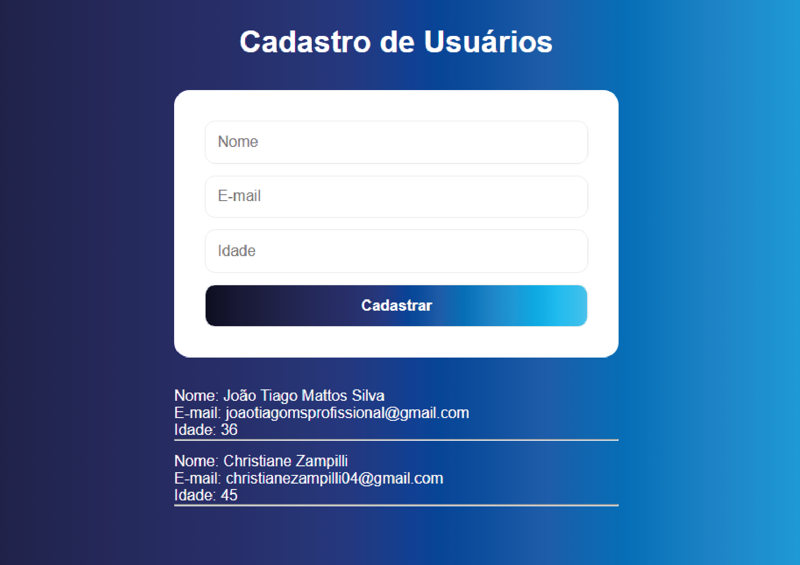

👤 Cadastro de Usuários

Aplicação web desenvolvida com React + Vite para gerenciamento de usuários com persistência de dados no navegador.

O projeto evoluiu de um sistema simples de cadastro para um CRUD completo com arquitetura organizada em componentes e hooks reutilizáveis.

---

## 🚀 Preview da Aplicação

---

🧩 Evolução do Projeto
🔹 Versão Inicial

Cadastro de usuários

Listagem de usuários

Persistência com localStorage

Estrutura simples em um único componente

🔹 Versão Atual

Cadastro de usuários

Edição de usuários existentes

Exclusão de usuários

Atualização automática da lista

Separação em componentes reutilizáveis

Hook personalizado para persistência de dados

Estrutura de pastas organizada como projeto profissional

Este projeto foi evoluído para simular um fluxo real de aplicação front-end moderna.

✨ Funcionalidades Atuais

✅ Cadastro de usuários via formulário controlado
✅ Edição de usuários existentes
✅ Remoção de usuários
✅ Listagem dinâmica atualizada automaticamente
✅ Persistência de dados no navegador
✅ Formulário reutilizado para criação e edição
✅ Interface simples e responsiva

🛠️ Tecnologias Utilizadas

React

Vite

JavaScript (ES6+)

HTML5

CSS3

LocalStorage API

Git

🧠 Conceitos Demonstrados

Gerenciamento de estado com useState

Efeitos colaterais com useEffect

Comunicação entre componentes via props

Atualização imutável de arrays em React

Componentização e separação de responsabilidades

Criação de hooks personalizados

Persistência de dados no navegador

Arquitetura de projeto front-end

Fluxo CRUD completo

Versionamento com Git

📁 Estrutura Atual do Projeto
src/
 ├── components/
 │    ├── UserForm.jsx
 │    └── UserList.jsx
 │
 ├── hooks/
 │    └── useUsersStorage.js
 │
 ├── pages/
 │    └── Home.jsx
 │
 ├── App.jsx
 ├── App.css
 └── main.jsx

Arquitetura organizada por responsabilidade:

UI separada da lógica

Persistência isolada em hook

Página responsável pelo fluxo da aplicação

Testes básicos de interface

🎯 Objetivo de Aprendizado

Este projeto foi desenvolvido para consolidar práticas modernas de desenvolvimento front-end:

✔ Criação de interfaces com React
✔ Gerenciamento de estado e efeitos
✔ Persistência de dados local
✔ Arquitetura de componentes
✔ Implementação de CRUD completo
✔ Estrutura de projeto utilizada no mercado

🚀 Próximas Melhorias Planejadas

Integração com API REST

Consumo de API com Axios

Validação de formulário avançada

Feedback visual de operações

Deploy da aplicação

Testes básicos de interface

👨‍💻 Autor

João Tiago
Desenvolvedor Front-end
